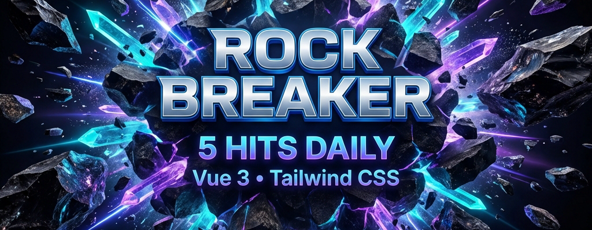

# 🔨 Rock Breaker / Разбей Скалу

> 🚨 **Важно:** на данный момент проект находится на стадии проектирования. Код не готов к использованию, запуск невозможен. Сейчас доступна только концепция и документация.

Геймифицированный трекер привычек, созданный для победы над исполнительной дисфункцией. Проект превращает рутину в игру, где большая цель — это Скала, которую нужно разбить.

## 🎯 Суть проекта

Вместо бесконечных списков дел — простая механика:

- **Метафора:** большая цель — это огромный камень.
- **Правило 5 ударов:** строго 5 задач в день, дающих 80% результата.
- **Импульс:** мгновенная визуальная и звуковая награда за каждое действие.

Подробнее о философии проекта читайте в [PURPOSE.md](docs/PURPOSE.md).

## 🛠 Технологический стек

- **Core:** Vue 3 (Composition API, Script Setup)
- **Build:** Vite
- **Styling:** Tailwind CSS
